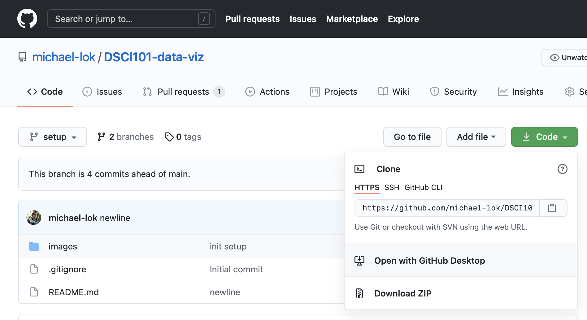

# DSCI101: Introduction to Data Visualization (R)
This project aims to teach people how to create preliminary visualizations of their data using the R programming language. If you haven't had any experience in coding, no worries! We'll learn together how simple it can be to ingest data and gain valuable insights.

*Sharpening your data visualization skills can open a world of opportunity*

## Course Format
Each subfolder of this project will contain a particular topic, along with a `solutions_{chapter}` file that provide an approach to the practice questions (as you'll learn through this course, there are **multiple** ways to code things and get to the same end solution; the `solutions_{chapter}` file will give you an example of a preferable one).

Make sure to download this project onto your device so that you have access to all necessary data sets and example `.R` scripts you can utilize in your own projects/code. You can do so by clicking on the `Code` button on the top right and clicking `Download ZIP`. You'll then need to unzip the contents; I'd recommend moving the subsequent folder `DSCI101-data-viz` out of the `Downloads` folder, but this is entirely up to you (just remember where the project is located on your machine!).

## Syllabus

### 1. Getting Started with R
This module will help with some of the basics of R. We'll skip on the boring history stuff for now, but focus in on how to code with R, re-using pieces of code, and saving our work in formats we can replicate.

* Installation of R
* Programming Syntax
* Assigning Variables
* Data Frame
* R Data Types
* Loading Data into the Workspace/Writing Datasets into Files
* **Practice:** Performing Calculations on a Data Set

### 2. Data Transformations
The data that you receive may not always be in a format that is immediately ready for processing. In the real world, data collection methods - web scraping, survey responses, CRM inputs from end users - can result in quite messy data. Gathering insights from this data can feel like finding the "diamond in the rough". We'll be introduced in this chapter to `dplyr`, a package that was designed for data manipulation.

* Installing R Packages
* Redefining Data Frame Columns
* The `mutate` Function
* Aggregation
* `dplyr` Pipes
* **Practice:** Transforming Survey Responses

*The OG Diamond in the Rough: Aladdin*
